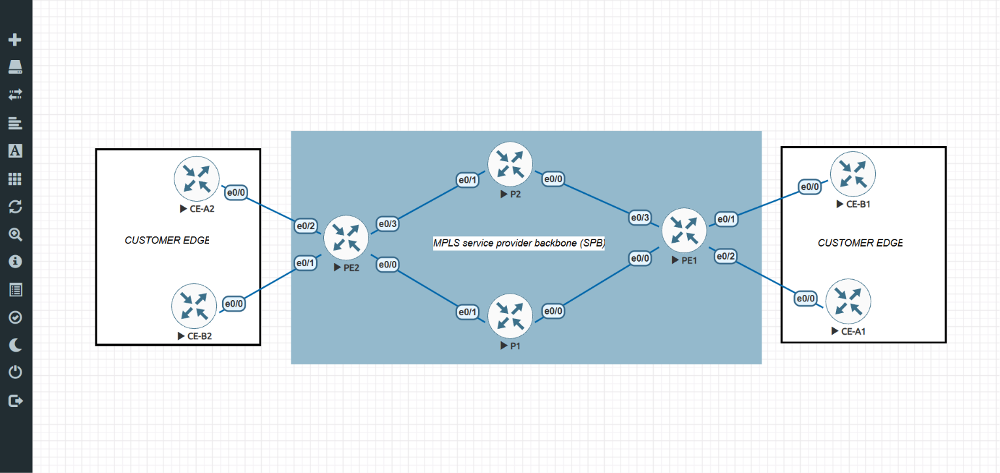

```text
┌──────────────────────────────────────────────────────────────────────────────┐
│  MPLS L3VPN — ARCHITECTURE ISP                                               │
│  Internship · Documentation Technique & Lab EVE-NG                                │
└──────────────────────────────────────────────────────────────────────────────┘
```

`STATUS: 🟢 OPERATIONAL` · `ZONE: LAB-EVE-NG` · `ASN: 65000` · `STACK: OSPF / LDP / MP-BGP / VRF`

─── [ 00 / MISSION BRIEF ] ─────────────────────────────────────────────────────

Ce dépôt documente un projet de stage centré sur la conception, la configuration et la validation d'une architecture **MPLS L3VPN** opérateur (RFC 4364). Le lab simule un ISP multi-clients avec isolation VRF, commutation par labels dans le cœur, et transport de routes VPNv4 entre Provider Edge.


─── [ 01 / REPO MAP ] ──────────────────────────────────────────────────────────

| Section | Chemin | Contenu |
|:--------|:-------|:--------|
| Navigation | [`docs/INDEX.md`](docs/INDEX.md) | Index global du dépôt |
| Théorie | [`docs/theory/`](docs/theory/) | IGP/EGP, algorithmes, fondements MPLS |
| Architecture | [`docs/architecture/`](docs/architecture/) | Topologie lab, stack protocolaire |
| Protocoles | [`docs/protocols/`](docs/protocols/) | OSPF, LDP, MP-BGP VPNv4, VRF |
| Implémentation | [`docs/implementation/`](docs/implementation/) | Configurations IOS et déploiement |
| Validation | [`docs/validation/`](docs/validation/) | Tests show + connectivité bout en bout |
| Configs | [`configs/`](configs/) | Fichiers de configuration routeurs |

─── [ 02 / PROTOCOL STACK ] ────────────────────────────────────────────────────

| Couche | Protocole | Rôle | État |
|:-------|:----------|:-----|:-----|
| IGP | `OSPF Area 0` | Loopbacks + liens cœur | `🟢 UP` |
| MPLS | `LDP` | Distribution labels / LSP | `🟢 UP` |
| VPN | `MP-BGP VPNv4` | Transport routes clients | `🟢 UP` |
| Isolation | `VRF CUST_A / CUST_B` | Tables de routage séparées | `🟢 UP` |
| Edge | `Static + redistribute` | Routage PE-CE | `🟢 UP` |

─── [ 03 / QUICK START ] ───────────────────────────────────────────────────────

Parcours recommandé pour la lecture :

```text
  theory/01-routing-classification.md
           │
           ▼
  architecture/01-lab-topology.md
           │
           ▼
  protocols/01-ospf.md ──► 02-ldp.md ──► 03-mp-bgp-vpnv4.md ──► 04-vrf.md
           │
           ▼
  implementation/ (déploiement séquentiel)
           │
           ▼
  validation/01-end-to-end-tests.md
```

> ┌─ 📡 NOC TELEMETRY NOTICE ──────────────────────────────────────────┐
> │ Environnement : EVE-NG Community Edition · Images Cisco IOL L3.      │
> │ Ordre de déploiement : OSPF → LDP → MP-BGP → VRF → PE-CE.           │
> │ Chaque brique est vérifiée par `show` avant passage à la suivante.   │
> └────────────────────────────────────────────────────────────────────┘

